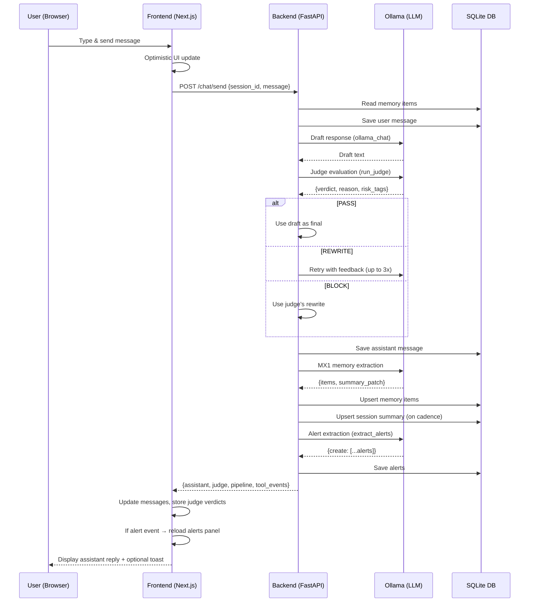

# CompanionOS — Complete Codebase Documentation

> **Purpose:** A detailed reference for every function, class, and module across the entire CompanionOS project.  
> **Generated:** 2026-03-21  
> **Stack:** FastAPI (Python) backend · Next.js (TypeScript) frontend · SQLite DB · Ollama LLM

---

## Table of Contents

1. [System Architecture Overview](#1-system-architecture-overview)
2. [Backend — `backend/app/`](#2-backend)
   - [main.py](#21-mainpy)
   - [db.py](#22-dbpy)
   - [pipeline.py](#23-pipelinepy)
   - [memory_extractor.py](#24-memory_extractorpy)
   - [personas.py](#25-personaspy)
   - [agents/Judge/judge_agent.py](#26-agentsjudgejudge_agentpy)
   - [tools/base.py](#27-toolsbasepy)
   - [tools/registry.py](#28-toolsregistrypy)
   - [tools/bootstrap.py](#29-toolsbootstrappy)
   - [tools/runner.py](#210-toolsrunnerpy)
   - [tools/alerts/alert_extractor.py](#211-toolsalertsalert_extractorpy)
   - [tools/alerts/alert_service.py](#212-toolsalertsalert_servicepy)
   - [tools/alerts/tool.py](#213-toolsalertstooly)
3. [Frontend — `frontend/`](#3-frontend)
   - [lib/types.ts](#31-libtypests)
   - [lib/api.ts](#32-libapiTS)
   - [app/page.tsx](#33-apppagetsx)
   - [components/ChatWindow.tsx](#34-componentschatwindowtsx)
   - [components/AlertsPanel.tsx](#35-componentsalertspaneltsx)
   - [components/PersonaSelect.tsx](#36-componentspersonaselecttsx)
   - [components/Toast.tsx](#37-componentstoasttsx)
4. [Data Flow Diagram](#4-data-flow-diagram)

---

## 1. System Architecture Overview

CompanionOS is an AI companion platform built around **LLM-powered personas** that talk to users via chat. Each message goes through a multi-stage pipeline:

```
User Message
    │
    ▼
[FastAPI /chat/send]
    │
    ├─► Memory Read (DB)
    ├─► Ollama LLM (draft response)
    ├─► Judge Agent (safety check / rewrite loop)
    ├─► Persist assistant reply (DB)
    ├─► Post-Chat Pipeline
    │       ├─► MX1 Memory Extraction (Ollama)
    │       └─► Session Summary Update
    └─► Tools Pipeline
            └─► AlertsTool → Alert Extraction (Ollama) → Save alert to DB
```

---

## 2. Backend

### 2.1 `main.py`
**File:** [`backend/app/main.py`](file:///Users/krm/Downloads/CompanionOS/backend/app/main.py)

The FastAPI application entry point. Defines all HTTP routes, startup, request schemas, and the core chat loop.

---

#### `build_system_prompt(persona, memory_items, tools)`
```python
def build_system_prompt(persona, memory_items=None, tools=None) -> str
```
**What it does:** Deterministically builds the LLM system prompt from the active persona configuration.

| Parameter | Type | Description |
|-----------|------|-------------|
| `persona` | `Dict` | Full persona config loaded from JSON |
| `memory_items` | `List[Dict]` | Up to 20 memory items injected into context |
| `tools` | `List[Any]` | Available tool plugins for capability hints |

**Returns:** A multi-line string of bullet rules for the system prompt.

**Key behaviors:**
- Reads `sliders` (empathy, directness, strictness), `style` (length, format), `memory_policy`, and `ethical_bounds` from the persona config.
- If tools are provided, lists them with descriptions and instructs the LLM it CAN set alerts/reminders.
- Enforces no-deception, no-dependency, no-medical-legal-claims guardrails from `ethical_bounds`.
- Appends up to 20 memory facts (key/value) to the prompt context.

---

#### `ollama_chat(system_prompt, history, user_message)`
```python
def ollama_chat(system_prompt: str, history: List[Dict], user_message: str) -> str
```
**What it does:** Sends a chat request to the Ollama `/api/chat` endpoint and returns the assistant response text.

| Parameter | Type | Description |
|-----------|------|-------------|
| `system_prompt` | `str` | The built persona system prompt |
| `history` | `List[Dict]` | Prior `[{role, content}]` messages |
| `user_message` | `str` | The current user input |

**Returns:** The raw assistant reply string from Ollama.

**Key behaviors:**
- Constructs message array: `[system] + history + [current user message]`.
- Uses `OLLAMA_BASE_URL` and `OLLAMA_MODEL` environment variables.
- Sets `stream: False` (blocking call, 60s timeout).
- Raises `HTTPException` if Ollama responds with an error.

---

#### `_startup()`
```python
@app.on_event("startup")
def _startup()
```
**What it does:** FastAPI startup hook — calls `init_db()` to create all database tables on application start.

---

#### `health()`
```python
@app.get("/health")
def health()
```
**What it does:** Simple health check endpoint.  
**Returns:** `{"status": "ok"}`

---

#### `list_personas_api()`
```python
@app.get("/personas")
def list_personas_api()
```
**What it does:** Returns a list of all loaded personas (excluding sensitive internal fields).  
**Returns:** Array of objects with `id`, `name`, `description`, `sliders`, `style`, `memory_policy`.

---

#### `get_persona_api(persona_id)`
```python
@app.get("/personas/{persona_id}")
def get_persona_api(persona_id: str)
```
**What it does:** Fetches a single persona by its ID.  
**Returns:** Full persona config dict. Raises 404 if not found.

---

#### `create_session_api(req)`
```python
@app.post("/sessions")
def create_session_api(req: CreateSessionReq)
```
**What it does:** Creates a new chat session tied to a persona.  
**Request Body:** `{ "persona_id": "<id>" }`  
**Returns:** `{ "session_id": "<uuid>" }` — the new session's UUID.  
**Raises:** 400 if `persona_id` is not a known persona.

---

#### `list_sessions_api()`
```python
@app.get("/sessions")
def list_sessions_api()
```
**What it does:** Lists all sessions in reverse chronological order.  
**Returns:** Array of session objects from the DB.

---

#### `get_session_messages_api(session_id, limit)`
```python
@app.get("/sessions/{session_id}/messages")
def get_session_messages_api(session_id: str, limit: int = 50)
```
**What it does:** Retrieves a session's metadata and its message history.  
**Returns:** `{ "session": {...}, "messages": [...] }`  
**Raises:** 404 if session not found.

---

#### `session_summary_api(session_id)`
```python
@app.get("/sessions/{session_id}/summary")
def session_summary_api(session_id: str)
```
**What it does:** Returns the session's current AI-generated summary, plus debug info about when the next update will occur.  
**Returns:** `{ "session": {...}, "summary": {...}, "debug": { "message_count", "should_update_at_next", "next_update_at" } }`

---

#### `list_memory_api(scope, session_id, limit)`
```python
@app.get("/memory")
def list_memory_api(scope: str, session_id: str | None, limit: int)
```
**What it does:** Lists memory items filtered by scope (`global` or `session`).  
**Returns:** Array of memory item dicts.  
**Raises:** 400 if scope is invalid.

---

#### `upsert_memory_api(req)`
```python
@app.post("/memory")
def upsert_memory_api(req: MemoryUpsertReq)
```
**What it does:** Creates or updates a memory item (key/value fact).  
**Request Body:** `{ scope, key, value, confidence, session_id? }`  
**Returns:** `{ "id": "<uuid>" }` of the created/updated memory item.

---

#### `delete_memory_api(mem_id)`
```python
@app.delete("/memory/{mem_id}")
def delete_memory_api(mem_id: str)
```
**What it does:** Permanently deletes a memory item by its UUID.  
**Returns:** `{ "deleted": true }`. Raises 404 if not found.

---

#### `chat_send_api(req)` ⭐ Core Function
```python
@app.post("/chat/send")
def chat_send_api(req: ChatSendReq)
```
**What it does:** The main chat endpoint — processes a user message end-to-end through the full pipeline.

**Step-by-step flow:**
1. **Memory read:** Loads relevant memory items based on the persona's `memory_policy.scope`.
2. **Persist user message:** Saves user message to the DB.
3. **Draft response:** Calls `ollama_chat()` to get an initial LLM reply.
4. **Judge retry loop (up to 3 attempts):**
   - Runs `run_judge()` to evaluate the draft against persona ethics.
   - `PASS` → use the draft as-is.
   - `REWRITE` → appends rejected draft + feedback to history, retries.
   - `BLOCK` → uses judge's rewritten response or fallback message.
5. **Persist assistant reply:** Saves final response to DB.
6. **Post-chat pipeline:** Runs `run_post_chat_pipeline()` for memory extraction + summary.
7. **Tools pipeline:** Runs `run_tools()` to detect and save alerts from conversation.

**Returns:**
```json
{
  "session_id": "...",
  "persona_id": "...",
  "assistant": "Final response text",
  "judge": { "verdict": "PASS", "reason": "...", "risk_tags": [] },
  "pipeline": { ...debug info... },
  "tool_events": [ ...alerts created... ]
}
```

---

#### `ollama_tags()`, `ollama_status()`, `ollama_pull()`
```python
@app.get("/ollama/tags")
@app.get("/ollama/status")
@app.post("/ollama/pull")
```
**What they do:** Proxy endpoints for checking Ollama service status, listing available models, and triggering model downloads.

---

#### `list_alerts_api(scope, session_id, status, limit)`
```python
@app.get("/alerts")
def list_alerts_api(...)
```
**What it does:** Lists alerts, filtered by scope, session, and status.  
**Returns:** Array of alert objects from DB.

---

#### `mark_alert_done_api(alert_id)` / `mark_alert_cancel_api(alert_id)`
```python
@app.post("/alerts/{alert_id}/done")
@app.post("/alerts/{alert_id}/cancel")
```
**What they do:** Updates an alert's status to `done` or `cancelled`.  
**Returns:** `{ "ok": true }`. Raises 404 if alert not found.

---

#### `get_due_alerts_api(session_id, limit)`
```python
@app.get("/alerts/due")
def get_due_alerts_api(session_id: str | None, limit: int)
```
**What it does:** Returns active alerts whose `due_at` timestamp is in the past (overdue alerts for notification polling).  
**Returns:** Array of due alert objects.

---

#### `list_tools_api()`
```python
@app.get("/tools")
def list_tools_api()
```
**What it does:** Lists all registered tool plugins with their metadata.  
**Returns:** Array of `{ tool_id, name, description }`.

---

#### `list_tool_settings_api(scope, session_id)`
```python
@app.get("/tools/settings")
def list_tool_settings_api(...)
```
**What it does:** Lists tool enable/disable settings for a scope.

---

#### `upsert_tool_setting_api(req)`
```python
@app.put("/tools/settings")
def upsert_tool_setting_api(req: ToolSettingUpsertReq)
```
**What it does:** Creates or updates a tool's enabled/disabled setting at global or session scope.

---

### Request Schemas (Pydantic Models)

| Schema | Fields | Purpose |
|--------|--------|---------|
| `CreateSessionReq` | `persona_id` | Create a session |
| `ChatSendReq` | `session_id`, `message` (1–4000 chars) | Send a chat message |
| `MemoryUpsertReq` | `scope`, `key`, `value`, `confidence`, `session_id?` | Save a memory fact |
| `CreateAlertReq` | `scope`, `session_id?`, `title`, `message` | Create an alert |
| `AckAlertReq` | `status` (acknowledged/dismissed) | Acknowledge/dismiss alert |
| `ToolSettingUpsertReq` | `scope`, `tool_id`, `enabled`, `session_id?` | Enable/disable a tool |

---

### 2.2 `db.py`
**File:** [`backend/app/db.py`](file:///Users/krm/Downloads/CompanionOS/backend/app/db.py)

SQLite database layer. Manages all persistent state: sessions, messages, memory, summaries, alerts, and tool settings.

**Database:** `/app/data/companionos.db`

**Tables:**
| Table | Primary Key | Purpose |
|-------|-------------|---------|
| `sessions` | `id (UUID)` | Chat sessions linked to a persona |
| `messages` | `id (UUID)` | Individual chat messages |
| `memory_items` | `id (UUID)` | Key-value memory facts |
| `session_summaries` | `session_id` | Rolling AI-generated session summaries |
| `alerts` | `id (UUID)` | User reminders/alerts with due dates |
| `tool_settings` | `id (UUID)` | Per-tool enable/disable overrides |

---

#### `_utc_now()`
```python
def _utc_now() -> str
```
**What it does:** Returns current UTC time as ISO 8601 string (e.g., `"2026-03-21T05:50:31Z"`).

---

#### `get_conn()`
```python
def get_conn() -> sqlite3.Connection
```
**What it does:** Opens and returns a SQLite connection to the database.
- Creates the parent directory (`/app/data/`) if it doesn't exist.
- Sets `row_factory = sqlite3.Row` so rows behave like dicts.

---

#### `init_db()`
```python
def init_db() -> None
```
**What it does:** Creates all database tables if they don't already exist (`CREATE TABLE IF NOT EXISTS`). Called on application startup.

---

#### `create_session(persona_id)`
```python
def create_session(persona_id: str) -> str
```
**What it does:** Inserts a new session record into the `sessions` table.  
**Returns:** The new session UUID string.

---

#### `list_sessions()`
```python
def list_sessions() -> List[Dict[str, Any]]
```
**What it does:** Retrieves all sessions, ordered newest first.  
**Returns:** List of `{id, persona_id, created_at}` dicts.

---

#### `get_session(session_id)`
```python
def get_session(session_id: str) -> Dict[str, Any] | None
```
**What it does:** Fetches a single session by its UUID.  
**Returns:** Session dict or `None` if not found.

---

#### `add_message(session_id, role, content)`
```python
def add_message(session_id: str, role: str, content: str) -> str
```
**What it does:** Inserts a new message (user or assistant) into the `messages` table.  
**Returns:** The new message UUID string.  
**Note:** `role` must be `"user"` or `"assistant"` (enforced by DB constraint).

---

#### `get_messages(session_id, limit)`
```python
def get_messages(session_id: str, limit: int = 50) -> List[Dict[str, Any]]
```
**What it does:** Retrieves messages for a session in chronological (ascending) order.  
**Returns:** List of `{id, session_id, role, content, created_at}` dicts.

---

#### `count_messages(session_id)`
```python
def count_messages(session_id: str) -> int
```
**What it does:** Returns the total count of messages in a session.  
**Used by:** Pipeline to determine if a summary update is due (every 6 messages).

---

#### `upsert_memory_item(scope, key, value, confidence, session_id, source_message_id)`
```python
def upsert_memory_item(...) -> str
```
**What it does:** Inserts a new memory item or updates an existing one if the same `scope + key + session_id` already exists.  

| Parameter | Description |
|-----------|-------------|
| `scope` | `"global"` or `"session"` |
| `key` | Fact identifier (e.g., `"user_name"`) |
| `value` | Fact value (e.g., `"Alice"`) |
| `confidence` | Float 0.0–1.0 confidence score |
| `session_id` | Required for `session` scope |
| `source_message_id` | Which message triggered this memory |

**Returns:** UUID of created/updated memory item.

---

#### `list_memory_items(scope, session_id, limit)`
```python
def list_memory_items(scope: str, session_id: str | None, limit: int) -> List[Dict]
```
**What it does:** Lists memory items filtered by scope.
- `global`: returns all global facts.
- `session`: returns session-scoped facts for the given `session_id`.  
**Returns:** List of memory item dicts, ordered by most recently updated.

---

#### `delete_memory_item(mem_id)`
```python
def delete_memory_item(mem_id: str) -> bool
```
**What it does:** Permanently deletes a memory item by UUID.  
**Returns:** `True` if a row was deleted, `False` if not found.

---

#### `get_session_summary(session_id)`
```python
def get_session_summary(session_id: str) -> Dict[str, Any] | None
```
**What it does:** Retrieves the current session summary from the DB.  
**Returns:** `{session_id, summary, open_loops (list), updated_at}` or `None` if no summary exists yet.  
**Note:** Safely parses `open_loops` from JSON string.

---

#### `upsert_session_summary(session_id, summary, open_loops)`
```python
def upsert_session_summary(session_id: str, summary: str, open_loops: list[str]) -> None
```
**What it does:** Creates or updates the summary for a session.  
**Stores:** `open_loops` as a JSON-serialized string in the DB.

---

#### `create_alert(scope, title, body, due_at, confidence, session_id, source_message_id)`
```python
def create_alert(...) -> str
```
**What it does:** Inserts a new alert/reminder into the `alerts` table with initial status `"active"`.  
**Returns:** The new alert UUID string.

| Parameter | Description |
|-----------|-------------|
| `scope` | `"global"` or `"session"` |
| `title` | Short alert title |
| `body` | Detailed alert body text |
| `due_at` | ISO timestamp when alert is due |
| `confidence` | LLM extraction confidence score |
| `session_id` | For session-scoped alerts |

---

#### `list_alerts(scope, session_id, status, limit)`
```python
def list_alerts(scope: str, session_id: str | None, status: str | None, limit: int) -> List[Dict]
```
**What it does:** Retrieves alerts filtered by scope, session, and optional status.  
**Returns:** List of alert dicts, newest first.

---

#### `update_alert_status(alert_id, status)`
```python
def update_alert_status(alert_id: str, status: str) -> bool
```
**What it does:** Updates an alert's status to `"active"`, `"done"`, or `"cancelled"`.  
**Returns:** `True` if updated, `False` if not found.  
**Raises:** `ValueError` for invalid status values.

---

#### `get_due_alerts(session_id, limit)`
```python
def get_due_alerts(session_id: str | None, limit: int) -> List[Dict]
```
**What it does:** Queries for active alerts where `due_at <= now`. Used for notification polling.  
**Returns:** List of overdue alert dicts, ordered by `due_at ASC`.

---

#### `upsert_tool_setting(scope, tool_id, enabled, session_id)`
```python
def upsert_tool_setting(scope: str, tool_id: str, enabled: bool, session_id: str | None) -> str
```
**What it does:** Creates or updates a tool enable/disable setting.  
**Returns:** UUID of the setting record.

---

#### `list_tool_settings(scope, session_id, limit)`
```python
def list_tool_settings(scope: str, session_id: str | None, limit: int) -> list[dict]
```
**What it does:** Lists tool settings for a given scope.

---

#### `get_effective_tool_enabled_map(session_id, tool_ids)`
```python
def get_effective_tool_enabled_map(session_id: str, tool_ids: list[str]) -> dict[str, bool]
```
**What it does:** Computes the final enabled/disabled state for each tool by layering settings:
> **Priority:** Session override > Global default > True (enabled by default)

**Returns:** `{ "tool_id": True/False }` dict for all requested tool IDs.

---

### 2.3 `pipeline.py`
**File:** [`backend/app/pipeline.py`](file:///Users/krm/Downloads/CompanionOS/backend/app/pipeline.py)

The post-chat pipeline — runs after every user/assistant exchange to extract memory and update the session summary.

**Config (from env vars):**
| Variable | Default | Purpose |
|----------|---------|---------|
| `MX1_CONFIDENCE_THRESHOLD` | `0.8` | Minimum confidence to save a memory item |
| `MX1_RECENT_MESSAGES` | `10` | How many messages to send to MX1 |
| `SUMMARY_CADENCE` | `6` | Update summary every N messages |
| `ALLOW_GLOBAL_WRITE` | `true` | Whether MX1 can write global memory |

---

#### `_fallback_summary_from_recent(recent, msg_count)`
```python
def _fallback_summary_from_recent(recent: List[Dict], msg_count: int) -> str
```
**What it does:** Generates a simple fallback summary from the last 4 messages when MX1 fails or returns empty.  
**Returns:** A string like `"Session with 12 messages. Recent: user: hello | assistant: hi there..."`

---

#### `run_post_chat_pipeline(session_id, persona)` ⭐
```python
def run_post_chat_pipeline(session_id: str, persona: Dict[str, Any]) -> Dict[str, Any]
```
**What it does:** Orchestrates memory extraction and session summary update after each chat turn.

**Step-by-step:**
1. Loads last N messages from DB.
2. Counts total messages to compute `should_update_summary` (every `SUMMARY_CADENCE` messages).
3. Loads existing session summary.
4. Runs `extract_mx1()` → gets memory items + summary patch + raw model output.
5. Upserts all valid memory items to DB.
6. If it's a summary cadence: saves the new summary (or a fallback if MX1 returned empty).
7. Emergency exception handling: writes a fallback summary even if pipeline fails.

**Returns:** Debug dict with `{session_id, msg_count, should_update_summary, memory_items_upserted, summary_updated, summary_len, errors}`.

---

### 2.4 `memory_extractor.py`
**File:** [`backend/app/memory_extractor.py`](file:///Users/krm/Downloads/CompanionOS/backend/app/memory_extractor.py)

Implements the **MX1** (Memory Extractor version 1) — an LLM-based extractor that reads recent conversation and produces structured memory facts and a session summary patch.

---

#### `_extract_json_object(text)`
```python
def _extract_json_object(text: str) -> Optional[Dict]
```
**What it does:** Best-effort extraction of a JSON object from raw LLM output.
- First tries to find a fenced ` ```json ... ``` ` block.
- Falls back to finding the first `{...}` in the text.
- Falls back to trimming to the last `}`.  
**Returns:** Parsed dict or `None` on failure.

---

#### `_clamp01(x)`
```python
def _clamp01(x: float) -> float
```
**What it does:** Clamps a float value between 0.0 and 1.0.

---

#### `_load_mx1_prompts()`
```python
def _load_mx1_prompts() -> Tuple[str, str]
```
**What it does:** Reads the MX1 `system.txt` and `schema.json` prompt files from `backend/app/prompts/mx1/`.  
**Returns:** `(system_text, schema_json_text)`  
**Raises:** `FileNotFoundError` if either file is missing.

---

#### `build_mx1_prompt(persona, session_summary, recent_messages, allow_global_write)`
```python
def build_mx1_prompt(...) -> str
```
**What it does:** Constructs the full prompt for the MX1 memory extractor by combining:
- The loaded system prompt template.
- The persona's memory policy settings.
- The current session summary and open loops.
- Last 10 recent messages formatted as `USER: ...` / `ASSISTANT: ...`.
- The JSON output schema.

**Returns:** Complete prompt string ready to send to Ollama.

---

#### `run_mx1_ollama(ollama_base_url, model, prompt, timeout_s)`
```python
def run_mx1_ollama(ollama_base_url: str, model: str, prompt: str, timeout_s: int) -> str
```
**What it does:** Calls Ollama's `/api/generate` endpoint (single-turn prompt, not chat) for structured JSON generation.  
**Returns:** Raw response text from the model.

---

#### `validate_mx1_output(data, confidence_threshold, allow_scopes)`
```python
def validate_mx1_output(data: Dict, confidence_threshold: float, allow_scopes: tuple) -> Tuple[List[Dict], Dict]
```
**What it does:** Validates and filters the raw MX1 JSON output for safety and correctness.

**Validation rules per memory item:**
- `scope` must be in `allow_scopes`.
- `key` must be 1–64 characters matching `[a-z0-9_]+` only.
- `value` must be 1–400 characters string.
- `confidence` must meet the `confidence_threshold` (default 0.8).
- Hard cap: max **5 items** per extraction run.

**Returns:** `(accepted_items, summary_patch)` where:
- `accepted_items` = validated memory items list.
- `summary_patch` = `{summary: str, open_loops: [str]}` normalized dict.

---

#### `extract_mx1(ollama_base_url, model, persona, session_summary, recent_messages, confidence_threshold, allow_global_write)` ⭐
```python
def extract_mx1(...) -> Tuple[List[Dict], Dict, str]
```
**What it does:** The full MX1 extraction pipeline — build prompt → call model → parse JSON → validate.  
**Returns:** `(accepted_items, summary_patch, raw_model_text)`

---

#### `generate_session_summary(messages, ollama_base_url, model, timeout_s)`
```python
def generate_session_summary(messages: List[str], ...) -> str
```
**What it does:** Standalone utility that calls Ollama to generate a 3–4 sentence summary from a message list. Uses last 20 messages.  
**Returns:** Summary string, or fallback `"Session with N messages."` on error.

---

### 2.5 `personas.py`
**File:** [`backend/app/personas.py`](file:///Users/krm/Downloads/CompanionOS/backend/app/personas.py)

Loads and validates persona configuration files from the `/app/personas/` directory.

**Required persona fields:** `id`, `name`, `description`, `sliders`, `style`, `memory_policy`, `ethical_bounds`, `tool_permissions`

---

#### `_is_valid_persona(data)`
```python
def _is_valid_persona(data: dict) -> bool
```
**What it does:** Returns `True` if the persona dict contains all required fields.

---

#### `load_personas()`
```python
def load_personas() -> Dict[str, dict]
```
**What it does:** Scans `/app/personas/*.json`, loads and validates each file.
- Skips files missing required fields (logs a warning).
- Skips files with duplicate IDs.
- Skips files that fail to parse.

**Returns:** `{ persona_id: persona_dict }` mapping.

---

### 2.6 `agents/Judge/judge_agent.py`
**File:** [`backend/app/agents/Judge/judge_agent.py`](file:///Users/krm/Downloads/CompanionOS/backend/app/agents/Judge/judge_agent.py)

The **Judge Agent** — an LLM that evaluates every LLM draft response for safety and persona-alignment before it's sent to the user.

---

#### `_read_text(path)`
```python
def _read_text(path: Path) -> str
```
**What it does:** Reads a UTF-8 text file and returns its contents.

---

#### `_prompt_dir()`
```python
def _prompt_dir() -> Path
```
**What it does:** Returns the path to Judge's `prompts/` directory.

---

#### `load_judge_prompts()`
```python
def load_judge_prompts() -> tuple[str, str]
```
**What it does:** Reads `judge_system.txt` and `judge_user.txt` from the Judge's prompts directory.  
**Returns:** `(system_text, user_template_text)`

---

#### `_memory_to_text(memory_items)`
```python
def _memory_to_text(memory_items: Optional[List[Dict]]) -> str
```
**What it does:** Formats up to 20 memory items as a bulleted string for the Judge prompt.  
**Returns:** Multi-line string like `"- key: value (scope=global)"` or `"(none)"` if empty.

---

#### `_ollama_chat(ollama_base_url, model, system_prompt, user_prompt, timeout_s, max_tokens)`
```python
def _ollama_chat(...) -> str
```
**What it does:** Calls Ollama `/api/chat` with a system + user message pair.  
**Returns:** The model's response content string.  
**Note:** Uses `num_predict` to limit tokens (default 256).

---

#### `run_judge(persona, user_message, assistant_draft, memory_items)` ⭐
```python
def run_judge(*, persona, user_message, assistant_draft, memory_items=None) -> Dict[str, Any]
```
**What it does:** Runs the AI judge to evaluate an assistant draft response.

**Behavior:**
1. Checks `JUDGE_ENABLED` env var — returns `PASS` immediately if disabled.
2. Loads judge system + user prompt templates.
3. Formats the user prompt with persona JSON, memory, user message, and the draft.
4. Calls Ollama and extracts a JSON verdict from the response.
5. Extracts `verdict` (PASS/REWRITE/BLOCK), `reason`, `risk_tags`, `rewritten_response`, `feedback`.
6. If verdict is neither PASS/REWRITE/BLOCK, defaults to PASS.
7. On any exception: safely returns `PASS` (fail-open, never blocks users due to judge failure).

**Returns:**
```python
{
  "verdict": "PASS" | "REWRITE" | "BLOCK",
  "feedback": "...",            # Only on REWRITE
  "rewritten_response": "...", # Only on REWRITE/BLOCK
  "reason": "...",
  "risk_tags": ["..."]
}
```

---

### 2.7 `tools/base.py`
**File:** [`backend/app/tools/base.py`](file:///Users/krm/Downloads/CompanionOS/backend/app/tools/base.py)

Defines the shared data contracts for the tool system.

---

#### `ToolContext` (dataclass)
```python
@dataclass
class ToolContext
```
**What it does:** The context object passed to every tool plugin when it runs.

| Field | Type | Description |
|-------|------|-------------|
| `session_id` | `str` | Current session UUID |
| `persona` | `Dict` | Active persona config |
| `memory_items` | `List[Dict]` | Current memory items |
| `session_summary` | `Optional[Dict]` | Current session summary |
| `recent_messages` | `List[Dict]` | Last N messages `[{role, content}]` |
| `user_message` | `str` | The user's current input |
| `assistant_final` | `str` | The final assistant response |
| `ollama_base_url` | `str` | Ollama service URL |
| `ollama_model` | `str` | Ollama model name |

---

#### `ToolPlugin` (Protocol)
```python
class ToolPlugin(Protocol)
```
**What it does:** Defines the interface every tool plugin must implement.

| Method/Field | Description |
|--------------|-------------|
| `id: str` | Unique tool identifier (e.g., `"alerts"`) |
| `name: str` | Display name |
| `should_run(ctx) -> bool` | Whether the tool should run for this context |
| `run(ctx) -> List[Dict]` | Execute the tool and return UI-friendly events |

---

### 2.8 `tools/registry.py`
**File:** [`backend/app/tools/registry.py`](file:///Users/krm/Downloads/CompanionOS/backend/app/tools/registry.py)

Plugin registry for tool management.

---

#### `env_bool(name, default)`
```python
def env_bool(name: str, default: bool) -> bool
```
**What it does:** Reads an environment variable and interprets it as a boolean.  
**True values:** `"1"`, `"true"`, `"yes"`, `"y"`, `"on"`.

---

#### `ToolsRegistry` (class)

**What it does:** A container for all registered tool plugins.

##### `__init__()`
Initializes an empty `_tools: Dict[str, ToolPlugin]` dictionary.

##### `register(tool)`
```python
def register(tool: ToolPlugin) -> None
```
**What it does:** Adds a tool plugin to the registry, keyed by `tool.name`.

##### `get(name)`
```python
def get(name: str) -> ToolPlugin | None
```
**What it does:** Retrieves a tool plugin by name.

##### `list_tools()`
```python
def list_tools() -> List[ToolPlugin]
```
**What it does:** Returns all registered tool plugins.

##### `enabled_tools()`
```python
def enabled_tools() -> List[ToolPlugin]
```
**What it does:** Returns only tools whose `TOOLS_{NAME}_ENABLED` env var is true (default true).

---

### 2.9 `tools/bootstrap.py`
**File:** [`backend/app/tools/bootstrap.py`](file:///Users/krm/Downloads/CompanionOS/backend/app/tools/bootstrap.py)

#### `build_tools_registry()`
```python
def build_tools_registry() -> ToolsRegistry
```
**What it does:** Creates and populates the global `ToolsRegistry` with all available tool plugins.  
Currently registers: `AlertsTool`.  
**Returns:** A fully configured `ToolsRegistry`.

---

### 2.10 `tools/runner.py`
**File:** [`backend/app/tools/runner.py`](file:///Users/krm/Downloads/CompanionOS/backend/app/tools/runner.py)

#### `run_tools(registry, ctx, enabled_map)`
```python
def run_tools(registry: ToolsRegistry, ctx: ToolContext, enabled_map: dict[str, bool]) -> list[dict]
```
**What it does:** Iterates all registered tools and runs each enabled one after a chat turn.

**Behavior per tool:**
- If `enabled_map[tool.id]` is `False` → appends a `"skipped"` event.
- Otherwise → calls `tool.run(ctx)` and extends events list.
- On exception → logs error and appends an `"error"` event (never crashes the main response).

**Returns:** List of all tool events (dicts), merged from all tools.

---

### 2.11 `tools/alerts/alert_extractor.py`
**File:** [`backend/app/tools/alerts/alert_extractor.py`](file:///Users/krm/Downloads/CompanionOS/backend/app/tools/alerts/alert_extractor.py)

LLM-based intent extractor that detects reminder/alert creation requests in conversations.

---

#### `_read_text(path)` / `_prompt_dir()`
Utility: reads a text file / returns the alerts prompts directory path.

---

#### `load_alert_prompts()`
```python
def load_alert_prompts() -> tuple[str, str]
```
**What it does:** Loads `system.txt` and `template.txt` from `tools/alerts/prompts/`.  
**Returns:** `(system_prompt, template_prompt)`.

---

#### `_format_messages_for_prompt(messages)`
```python
def _format_messages_for_prompt(messages: List[Dict]) -> str
```
**What it does:** Formats last 10 messages as labeled lines (`USER: ...` / `ASSISTANT: ...`).

---

#### `_format_memory_for_prompt(memory_items)`
```python
def _format_memory_for_prompt(memory_items: Optional[List[Dict]]) -> str
```
**What it does:** Formats up to 20 memory items as a bulleted list string.

---

#### `_ollama_chat(ollama_base_url, model, system_prompt, user_prompt, timeout_s)`
```python
def _ollama_chat(...) -> str
```
**What it does:** Calls Ollama `/api/chat` with a system+user message pair.  
**Returns:** The model response content string.

---

#### `_extract_json_from_response(text)`
```python
def _extract_json_from_response(text: str) -> Optional[Dict]
```
**What it does:** Extracts a JSON object from LLM output by:
1. Looking for a ` ```json {...} ``` ` fenced block.
2. Looking for the first `{...}` in the text.  
**Returns:** Parsed dict or `None`.

---

#### `extract_alerts(persona_json, memory_items, recent_messages, assistant_final_text, ...)` ⭐
```python
def extract_alerts(...) -> Dict[str, List[Dict]]
```
**What it does:** The main alert extraction function — sends recent conversation to an LLM and asks it to identify if the user wants an alert/reminder set.

**Behavior:**
1. Loads alert prompts.
2. Gets current time in IST (Asia/Kolkata timezone).
3. Formats memory and messages.
4. Calls Ollama with system + template prompt.
5. Parses LLM JSON response.
6. Validates: requires `title` and `due_at`; validates `repeat_rule` (DAILY/WEEKLY); limits to **2 alerts max**.

**Returns:**
```python
{
  "create": [
    {
      "title": "Meeting reminder",
      "body": "Don't forget your 3pm meeting",
      "due_at": "2026-03-21T15:00:00+05:30",
      "repeat_rule": null  # or "DAILY" / "WEEKLY"
    }
  ]
}
```
Returns `{"create": []}` on any error or when no alerts detected.

---

### 2.12 `tools/alerts/alert_service.py`
**File:** [`backend/app/tools/alerts/alert_service.py`](file:///Users/krm/Downloads/CompanionOS/backend/app/tools/alerts/alert_service.py)

DB-facing service layer for alert CRUD operations.

---

#### `execute_alert_creation(alerts, session_id, scope)`
```python
def execute_alert_creation(alerts: List[Dict], session_id: Optional[str], scope: str) -> List[Dict]
```
**What it does:** Takes the alert list from `extract_alerts()` and persists each to the database.

**Per alert:**
- Validates `title` and `due_at` are present; skips if missing.
- Clamps `confidence` to 0.0–1.0.
- Calls `create_alert()` DB function.
- Appends an `alert_created` tool event.
- Caps at **2 alerts per turn**.

**Returns:** List of `{type: "alert_created", alert_id, title, due_at}` event dicts.

---

#### `get_alerts_for_session(session_id, scope, status, limit)`
```python
def get_alerts_for_session(...) -> List[Dict]
```
**What it does:** Wrapper — lists alerts for a session using the DB layer.

---

#### `get_global_alerts(status, limit)`
```python
def get_global_alerts(status: Optional[str], limit: int) -> List[Dict]
```
**What it does:** Wrapper — lists global-scope alerts.

---

#### `mark_alert_done(alert_id)` / `mark_alert_cancelled(alert_id)`
```python
def mark_alert_done(alert_id: str) -> bool
def mark_alert_cancelled(alert_id: str) -> bool
```
**What they do:** Update alert status to `"done"` or `"cancelled"` via the DB layer.  
**Returns:** `True` if successful, `False` if alert not found.

---

### 2.13 `tools/alerts/tool.py`
**File:** [`backend/app/tools/alerts/tool.py`](file:///Users/krm/Downloads/CompanionOS/backend/app/tools/alerts/tool.py)

The `AlertsTool` plugin — plugs into the `ToolPlugin` protocol.

---

#### `AlertsTool` (class)

| Attribute | Value |
|-----------|-------|
| `id` | `"alerts"` |
| `name` | `"Alerts"` |
| `description` | Instructions for LLM on how to confirm alert creation to the user |

##### `should_run(ctx)`
```python
def should_run(self, ctx: ToolContext) -> bool
```
**What it does:** Returns `True` always — the tool runs after every chat turn.

##### `run(ctx)` ⭐
```python
def run(self, ctx: ToolContext) -> List[Dict]
```
**What it does:** Orchestrates the full alerts detection + creation flow:
1. Calls `extract_alerts()` to check if user requested an alert.
2. If none found, returns `[]`.
3. If alerts found, calls `execute_alert_creation()` to save to DB.
4. Returns a single tool event:
```python
[{ "type": "alert_created", "count": N, "items": [...created alerts...] }]
```

---

## 3. Frontend

### 3.1 `lib/types.ts`
**File:** [`frontend/lib/types.ts`](file:///Users/krm/Downloads/CompanionOS/frontend/lib/types.ts)

TypeScript type definitions for all data models shared between frontend components.

| Interface | Key Fields | Purpose |
|-----------|-----------|---------|
| `Persona` | `id, name, description, sliders, style, memory_policy` | Persona config |
| `Session` | `id, persona_id, created_at, updated_at, summary?` | Chat session |
| `Message` | `id, role, content, created_at` | Single chat message |
| `JudgeVerdict` | `verdict (PASS/REWRITE/BLOCK), reason, risk_tags` | Judge evaluation result |
| `ToolEvent` | `type, count?, message?` | Tool plugin output event |
| `ChatResponse` | `session_id, persona_id, assistant, judge, pipeline, tool_events, alerts_created` | Full API response for chat send |
| `Alert` | `id, title?, body?, content, priority, status, due_at, created_at` | Reminder alert |
| `AlertsResponse` | `alerts, total` | Alert list response |
| `SessionMessagesResponse` | `session, messages` | Session messages endpoint response |
| `SessionSummary` | `session_id, summary, open_loops, updated_at` | AI-generated summary |
| `SessionSummaryResponse` | `session, summary?, debug` | Summary endpoint response |

---

### 3.2 `lib/api.ts`
**File:** [`frontend/lib/api.ts`](file:///Users/krm/Downloads/CompanionOS/frontend/lib/api.ts)

The frontend API client — all HTTP calls to the backend go through this module.

**Base URL:** `NEXT_PUBLIC_API_BASE` env var or `http://localhost:8000`.

---

#### `fetchJSON<T>(url, options)`
```typescript
async function fetchJSON<T>(url: string, options?: RequestInit): Promise<T>
```
**What it does:** Generic HTTP fetch helper.
- Prepends `API_BASE` to the URL.
- Sets `Content-Type: application/json` header.
- Throws a descriptive `Error` if response is not `ok`.  
**Returns:** Parsed JSON as type `T`.

---

#### `api.getPersonas()`
**Endpoint:** `GET /personas`  
**Returns:** `Promise<Persona[]>` — all available personas.

---

#### `api.createSession(persona_id)`
**Endpoint:** `POST /sessions`  
**Returns:** `Promise<{ session_id: string }>` — new session UUID.

---

#### `api.getSessionMessages(session_id, limit)`
**Endpoint:** `GET /sessions/{session_id}/messages?limit={limit}`  
**Returns:** `Promise<SessionMessagesResponse>` — session info + message history.

---

#### `api.getSessionSummary(session_id)`
**Endpoint:** `GET /sessions/{session_id}/summary`  
**Returns:** `Promise<SessionSummaryResponse>` — session + AI summary + debug data.

---

#### `api.sendMessage(session_id, message)`
**Endpoint:** `POST /chat/send`  
**Returns:** `Promise<ChatResponse>` — assistant reply + judge + pipeline + tool events.

---

#### `api.getAlerts(params)`
**Endpoint:** `GET /alerts?scope=...&session_id=...&status=...&limit=...`  
**Returns:** `Promise<Alert[]>` — filtered list of alerts.

---

#### `api.updateAlert(alert_id, status)`
**Endpoint:** `POST /alerts/{alert_id}/done` or `POST /alerts/{alert_id}/cancel`  
**Returns:** `Promise<{ ok: boolean }>`

---

#### `api.getDueAlerts(session_id?)`
**Endpoint:** `GET /alerts/due?session_id=...`  
**Returns:** `Promise<Alert[]>` — overdue alerts for notification display.

---

### 3.3 `app/page.tsx`
**File:** [`frontend/app/page.tsx`](file:///Users/krm/Downloads/CompanionOS/frontend/app/page.tsx)

The main page component — root of the application UI, orchestrates all state and handlers.

**State:**
| State Variable | Type | Purpose |
|----------------|------|---------|
| `personas` | `Persona[]` | All available personas |
| `selectedPersonaId` | `string \| null` | Currently selected persona |
| `sessionId` | `string \| null` | Active session UUID |
| `messages` | `Message[]` | Current conversation messages |
| `alerts` | `Alert[]` | Current session alerts |
| `judgeVerdicts` | `Record<string, JudgeVerdict>` | Judge results keyed by message ID |
| `summary` | `string` | Current session summary text |
| `loading` | `boolean` | Global loading state |
| `alertsLoading` | `boolean` | Alerts panel loading state |
| `error` | `string \| null` | Error message for display |
| `toast` | `{message, type} \| null` | Current toast notification |
| `showAlerts` | `boolean` | Whether alerts panel is visible |
| `alertFilter` | `string` | Current alert status filter |

---

#### `loadPersonas()`
**What it does:** Fetches all personas from `api.getPersonas()` and sets `personas` state. Shows error if fetch fails.

---

#### `loadSessionFromStorage()`
**What it does:** On mount, reads `session_id` and `persona_id` from `localStorage`. If found, restores the previous session by loading messages, alerts, and summary.

---

#### `loadSessionMessages(sid)`
**What it does:** Fetches message history for a session and sets `messages` state.

---

#### `loadAlerts(sid, status)`
**What it does:** Fetches alerts for the current session filtered by status. Wrapped in `useCallback` to be stable for effect dependencies.  
**Manages:** `alertsLoading` state.

---

#### `checkDueAlerts()` (inside `useEffect`)
**What it does:** Called every 30 seconds when a session is active. Fetches due alerts; for each new one not yet notified, shows a toast notification and plays a notification sound (`/notification.mp3`).  
**Tracks already-notified alerts** using a local `Set<string>` to avoid duplicates.

---

#### `loadSummary(sid)`
**What it does:** Fetches the session summary and updates `summary` state. Silently ignores 404 (no summary yet).

---

#### `handleStartSession()`
**What it does:** Creates a new session via `api.createSession()`, stores IDs in `localStorage`, resets messages/summary, and loads initial alerts. Shows toast on success/error.

---

#### `handleSendMessage(message)` ⭐
**What it does:** Handles sending a user message.
1. **Optimistic update:** Adds a temporary user message to the UI immediately.
2. Calls `api.sendMessage()`.
3. On success: replaces temp message + adds real user + assistant messages.
4. Stores the judge verdict.
5. If `tool_events` contains an `alert_created` event: shows toast + reloads alerts.
6. Every 5 messages: refreshes the session summary.
7. On error: removes the temp message, shows error toast.

---

#### `handleUpdateAlert(alertId, status)`
**What it does:** Calls `api.updateAlert()` to mark an alert done or cancelled, then reloads alerts list.

---

#### `handleRefreshAlerts(status)`
**What it does:** Updates `alertFilter` state and reloads alerts with the new filter.

---

#### `handleEndSession()`
**What it does:** Clears all session state (messages, alerts, summary, verdicts), removes IDs from `localStorage`, shows info toast.

---

#### `Home()` — JSX Layout
**What it does:** Renders the 3-panel layout:
- **Left sidebar:** CompanionOS brand, `PersonaSelect`, session summary, Show Alerts / End Session buttons.
- **Main area:** `ChatWindow` + error banner.
- **Right panel** (conditional): `AlertsPanel` when `showAlerts` is true.
- **Overlay:** `Toast` when a notification is pending.

---

### 3.4 `components/ChatWindow.tsx`
**File:** [`frontend/components/ChatWindow.tsx`](file:///Users/krm/Downloads/CompanionOS/frontend/components/ChatWindow.tsx)

The chat interface component — renders messages and the message input form.

**Props:**
| Prop | Type | Description |
|------|------|-------------|
| `messages` | `Message[]` | Messages to display |
| `onSendMessage` | `(msg: string) => void` | Handler for sending messages |
| `loading` | `boolean` | Disables input during API calls |
| `sessionActive` | `boolean` | Shows empty state if no session |
| `judgeVerdicts` | `Record<string, JudgeVerdict>` | Judge results (currently stored but not displayed in UI) |

---

#### `scrollToBottom()`
**What it does:** Smoothly scrolls the message list to the bottom using a ref on an invisible div at the list end.  
**Triggered by:** `useEffect` whenever `messages` changes.

---

#### `handleSubmit(e)`
**What it does:** Form submit handler. Calls `onSendMessage` with trimmed input and clears the input field.  
Validates: input must be non-empty and `loading` must be false.

---

#### `getVerdictBadge(verdict)`
**What it does:** Maps a judge verdict string to Tailwind CSS class names for color-coding.
| Verdict | Color |
|---------|-------|
| `PASS` | Green |
| `REWRITE` | Yellow |
| `BLOCK` | Red |
| (default) | Gray |

---

#### `ChatWindow()` — JSX Render
**What it does:** Renders either:
- An **empty state** (centered message + icon) when `sessionActive` is false.
- The **full chat view** with a scrollable message list + input form when active.

**Messages:** User messages appear right-aligned (gradient bubble), assistant messages left-aligned (card bubble). A loading spinner appears in the send button during API calls.

---

### 3.5 `components/AlertsPanel.tsx`
**File:** [`frontend/components/AlertsPanel.tsx`](file:///Users/krm/Downloads/CompanionOS/frontend/components/AlertsPanel.tsx)

The right-side panel component for viewing and managing alerts/reminders.

**Props:**
| Prop | Type | Description |
|------|------|-------------|
| `alerts` | `Alert[]` | Alerts to display |
| `onUpdateAlert` | `(id, status) => void` | Handle done/cancel actions |
| `onRefresh` | `(status: string) => void` | Reload alerts with new filter |
| `onClose` | `() => void` | Close the panel |
| `loading` | `boolean` | Show loading spinner |

---

#### `handleFilterChange(newFilter)`
**What it does:** Updates local `filter` state and calls `onRefresh(newFilter)` to reload alerts with the new status filter.

---

#### `getPriorityColor(priority)`
**What it does:** Returns Tailwind class strings for left-border + background color based on alert priority.
| Priority | Color |
|----------|-------|
| `high` | Red |
| `medium` | Yellow |
| `low` | Blue |
| (default) | Gray |

---

#### `getStatusBadge(status)`
**What it does:** Returns badge CSS classes for alert status.
| Status | Style |
|--------|-------|
| `active` | Orange |
| `done` | Green |
| `cancelled` | Muted gray |

---

#### `AlertsPanel()` — JSX Render
**What it does:** Renders:
- **Header** with title and close (×) button.
- **Filter dropdown:** Active / Completed / Cancelled / All.
- **Alert list** with loading spinner or empty state. Each alert card shows: status badge, priority, content, creation time, and (if active) Done ✓ and Cancel ✕ action buttons.

---

### 3.6 `components/PersonaSelect.tsx`
**File:** [`frontend/components/PersonaSelect.tsx`](file:///Users/krm/Downloads/CompanionOS/frontend/components/PersonaSelect.tsx)

Component for selecting a persona and starting a session.

**Props:**
| Prop | Type | Description |
|------|------|-------------|
| `personas` | `Persona[]` | Available personas |
| `selectedPersonaId` | `string \| null` | Currently selected |
| `onSelect` | `(id: string) => void` | Selection handler |
| `onStartSession` | `() => void` | Start session handler |
| `loading` | `boolean` | Disables UI during loading |
| `hasActiveSession` | `boolean` | Disables selector when session is active |

---

#### `PersonaSelect()` — JSX Render
**What it does:** Renders:
- A **dropdown select** listing all personas (disabled when session is active).
- A **persona info card** with name + description when one is selected.
- A **"Start Session" button** (only shown when no active session).
- A **"Session Active" badge** with a pulsing green dot when a session is running.

---

### 3.7 `components/Toast.tsx`
**File:** [`frontend/components/Toast.tsx`](file:///Users/krm/Downloads/CompanionOS/frontend/components/Toast.tsx)

Auto-dismissing toast notification component.

**Props:**
| Prop | Type | Description |
|------|------|-------------|
| `message` | `string` | Notification text |
| `type` | `'success' \| 'error' \| 'info'` | Color theme |
| `onClose` | `() => void` | Dismiss handler |
| `duration` | `number` | Auto-dismiss delay (default 4000ms) |

---

#### `useEffect` (auto-dismiss)
Sets a `setTimeout(onClose, duration)` to automatically dismiss the toast. Clears the timer on unmount.

---

#### `getTypeStyles()`
**What it does:** Returns Tailwind background color classes per type.
| Type | Color |
|------|-------|
| `success` | Green |
| `error` | Red |
| `info` | Blue |

---

#### `Toast()` — JSX Render
**What it does:** Renders a fixed-position toast in the top-right corner with the message text and a dismiss ✕ button.

---

## 4. Data Flow Diagram



---

*Documentation generated from CompanionOS source code — 2026-03-21*
